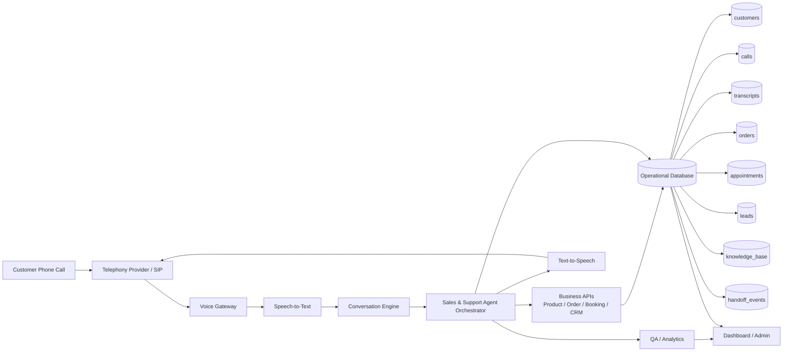
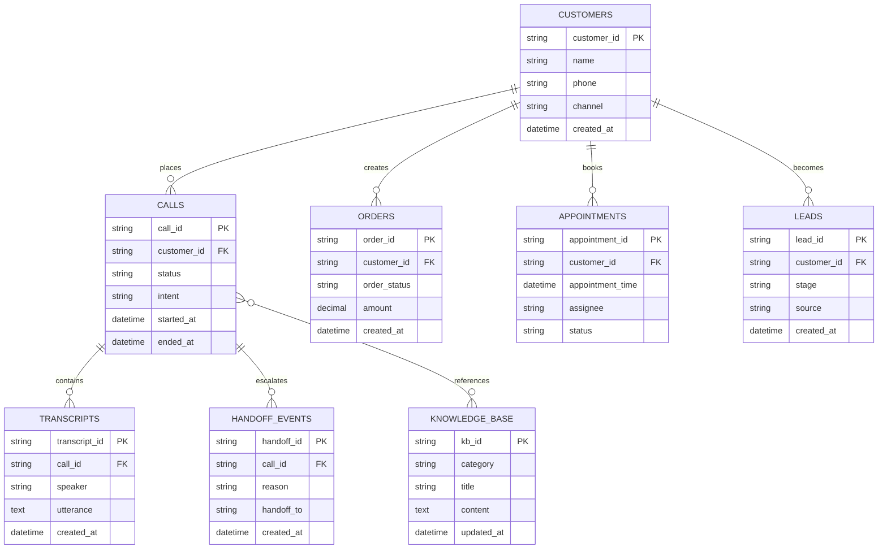

# OmniVoice AI

OmniVoice AI คือแพลตฟอร์ม **AI รับสายโทรศัพท์อัตโนมัติสำหรับธุรกิจ E-commerce** ที่เชื่อมต่อกับระบบร้านค้าเพื่อทำหน้าที่เป็นพนักงานขายอัจฉริยะ ตอบคำถามลูกค้า แนะนำสินค้า ปิดการขาย ตรวจสอบคำสั่งซื้อ และนัดหมายได้ตลอด 24 ชั่วโมง

## Repository Structure

```text
OmniVoice-AI
│
├─ .github
│  ├─ workflows
│  │  ├─ main.yml
│  │  ├─ docs-guard.yml
│  │  └─ security.yml
│  │
│  ├─ ISSUE_TEMPLATE
│  │  ├─ bug_report.md
│  │  ├─ feature_request.md
│  │  └─ ai-behavior.md
│  │
│  └─ pull_request_template.md
│
├─ CODEOWNERS
├─ CONTRIBUTING.md
├─ SECURITY.md
│
├─ docker
│  └─ entrypoint.sh
│
├─ Dockerfile
├─ docker-compose.yml
│
├─ docs
│  └─ voice-agent-architecture.md
│
├─ src
│  ├─ app.js
│  └─ routes
│
├─ tests
│
├─ package.json
├─ AGENTS.md
└─ README.md
```

## System Architecture Diagram (Database-driven)

แผนภาพด้านล่างแสดงโครงสร้างระบบที่เชื่อมระหว่าง telephony, AI orchestration, integration layer และโครงสร้างฐานข้อมูลหลักสำหรับการทำงานจริงของ OmniVoice AI



## Database Relationship Diagram



## Getting Started

```bash
npm ci
npm run dev
```

หรือรันผ่าน Docker

```bash
docker compose up --build
```


## Troubleshooting npm install (Node 22 / inotify)

หากเจอ error ตอนติดตั้งที่เกี่ยวกับ `node_modules/inotify` และ `node-gyp rebuild` ให้ล้าง dependency เดิมแล้วติดตั้งใหม่จาก lockfile:

```bash
rm -rf node_modules
npm ci
```

โปรเจกต์นี้ไม่ต้องพึ่ง native module `inotify` โดยตรง ดังนั้นการติดตั้งจาก `package-lock.json` ควรผ่านได้บน Node.js 20+.
